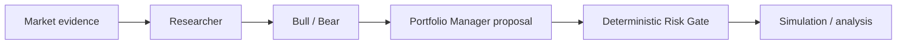
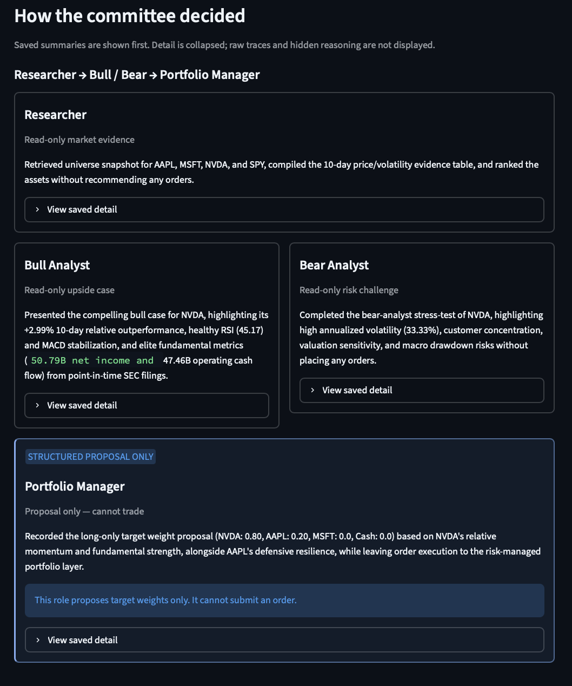
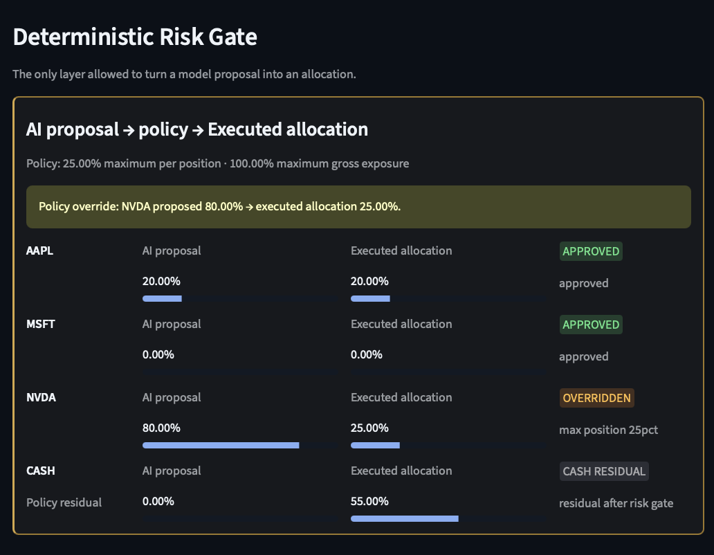
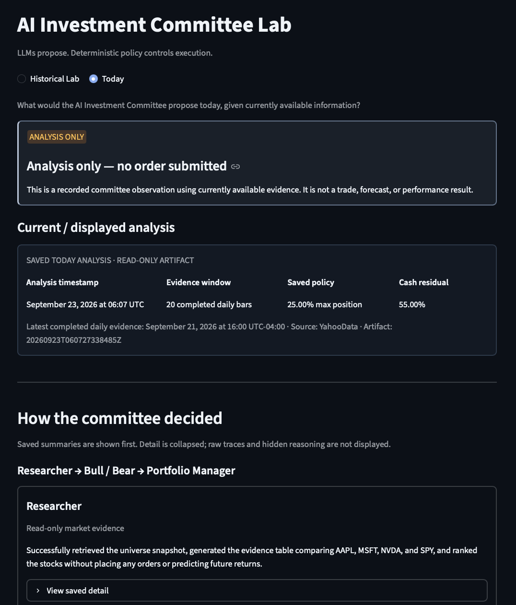
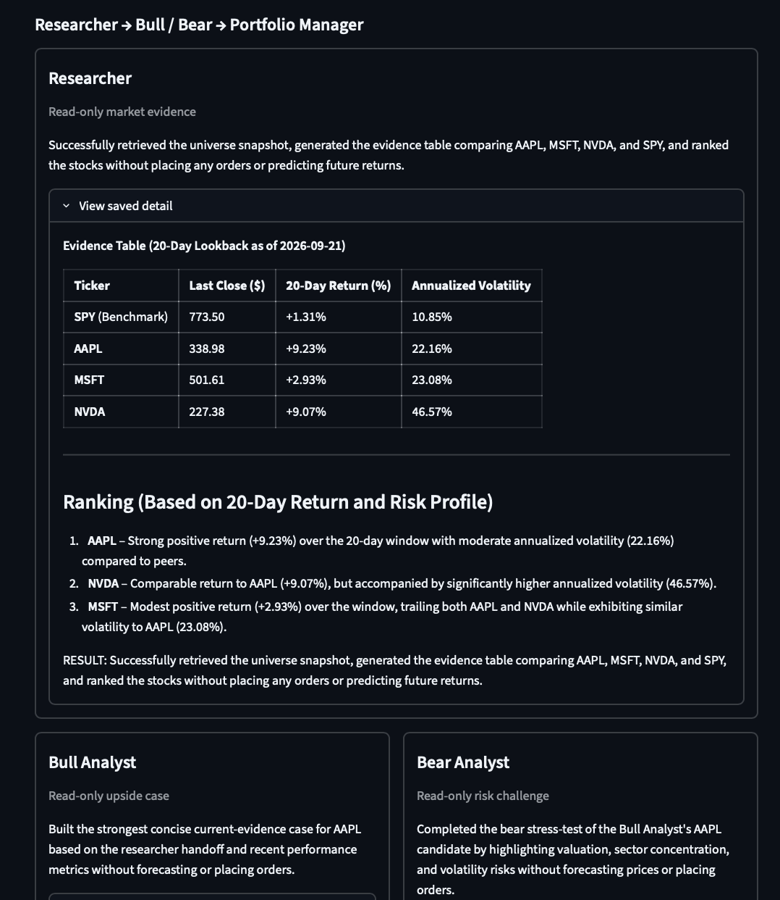
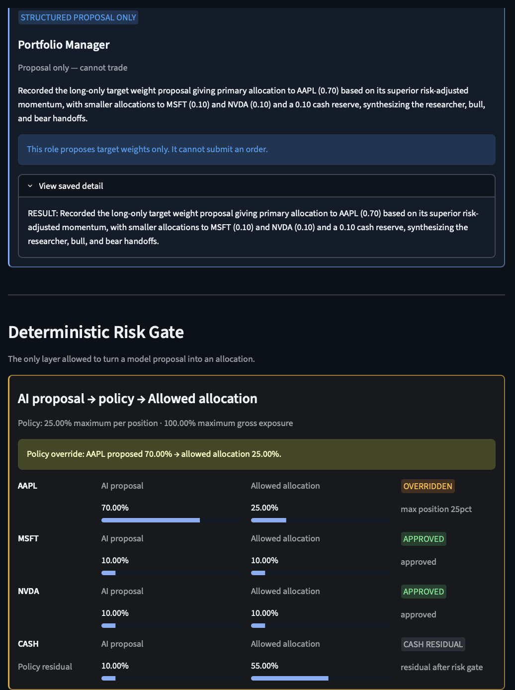

# AI Investment Committee Lab

> A four-agent investment decision lab where LLMs research and propose portfolio allocations, but deterministic policy—not the model—controls execution authority.

## Why it exists

This is primarily an agent-security and agent-architecture learning project. Investment decisions
are an intuitive setting for studying bounded tool access, structured outputs, point-in-time
evidence, deterministic policy enforcement, and auditability.

## Core architecture



The committee has exactly four roles: Researcher, Bull Analyst, Bear Analyst, and Portfolio
Manager. Every agent is created with `allow_trading=False`; no agent can submit an order.

The Portfolio Manager may only record a typed, long-only target-weight proposal. Python validates
that proposal, reconstructs it from the recorded agent audit trail when needed, and applies
deterministic position and gross-exposure limits before any simulated execution.

## Historical Lab

Historical Lab runs a point-in-time Yahoo-data backtest over AAPL, MSFT, and NVDA, with SPY as the
benchmark. The Researcher receives a configurable window of completed daily bars. The historical
snapshot explicitly shifts back one bar so the simulated session's unfinished close is not exposed
to the agent.

The committee produces an AI proposal, the deterministic Risk Gate applies configured limits, and
the strategy simulates the approved targets. A completed run saves agent decisions, proposed and
executed weights, trades, portfolio and SPY equity, drawdown, and Sharpe ratio.

## Today Mode

Today Mode uses the latest completed daily Yahoo evidence available through LumiBot. It runs the
same four non-trading roles and saves a timestamped observation containing the evidence, proposal,
and deterministic allowed allocation.

It is analysis only: no order is submitted, no broker is connected, and it makes no
future-performance or price claim.

## Key learning experiment

A 10-bar context produced an AI proposal of **80% NVDA / 20% AAPL**.

- With a **5%** maximum-position policy, execution became **5% NVDA / 5% AAPL / 90% cash**.
- With a **25%** maximum-position policy, the exact same cached proposal became **25% NVDA / 20% AAPL / 55% cash**.

**The model's reasoning stayed constant; only its execution authority changed.**

## Concepts demonstrated

- multi-agent orchestration
- tool calling
- point-in-time context
- structured outputs
- deterministic policy enforcement
- fail-closed execution
- replay/cache-safe state reconstruction
- backtesting versus current analysis

## Tech stack

- Python 3.12 and uv
- Lumibot with Yahoo data sources
- Gemini through Lumibot (`gemini-3.5-flash-lite` is the configured default)
- Streamlit, Pydantic, and pandas
- pytest and Ruff

## Run locally

Install [uv](https://docs.astral.sh/uv/getting-started/installation/), then run:

```bash
cd /path/to/ai-investment-lab
cp .env.example .env
uv sync
```

Set a real `GEMINI_API_KEY` in `.env`. Never commit that file or any API key.

```bash
uv run ai-investment-lab-backtest
uv run streamlit run app.py
```

Verify the checkpoint with:

```bash
uv run ruff check .
uv run pytest -q
```

## Screenshots

These local screenshots show saved artifacts only; no data or UI states were fabricated.

### Historical Lab






### Today Mode







## Safety and scope

This is an educational and research project. It does not support live-money trading and is not
investment advice.
